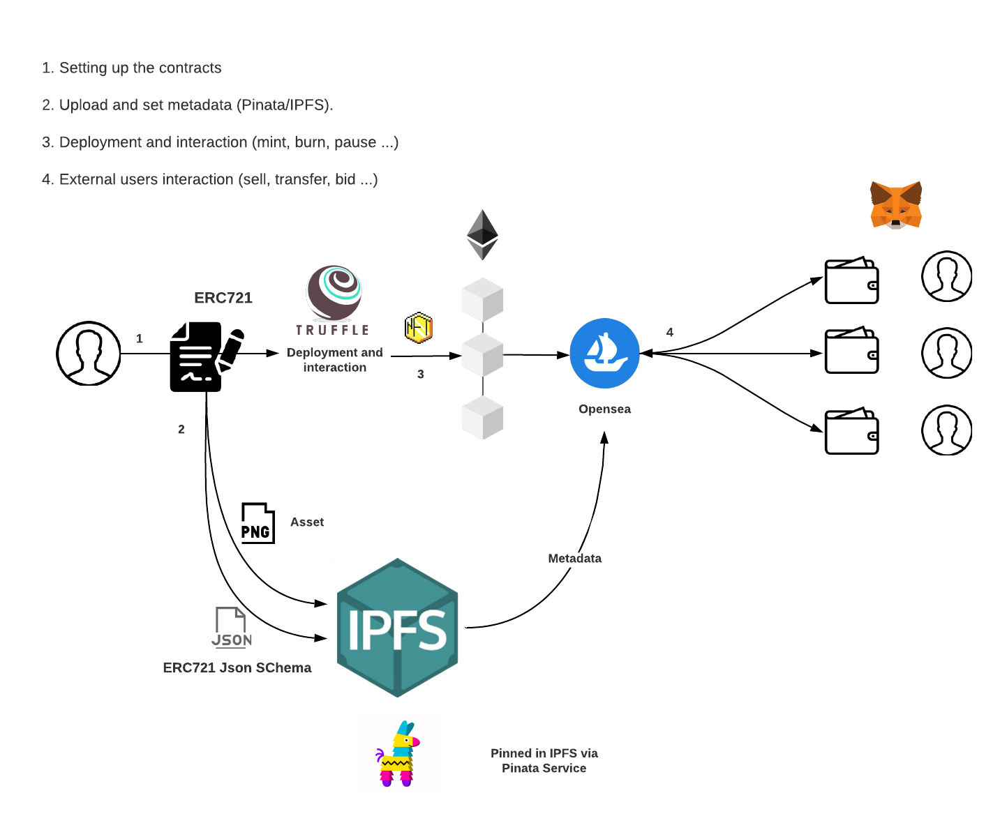

# NFT Tutorial
En este tutorial de NFT vamos a crear desde cero un smart contract en Goerli, la red testnet de ethereum y así poder generar nuestro primer NFT

## Pre-requisites
### NodeJS — https://nodejs.org/es/download/
Entorno donde trabajaremo
### VsCode - https://code.visualstudio.com/download
IDE para crear el smart contract y poder generear nuestro NFT, tiene extensiones de solidity para facilitar el desarrollo en solidity
### Truffle — https://www.trufflesuite.com/truffle
Truffle es un entorno de desarrollo, framework y pipelines de activos para Ethereum, con el objetivo de facilitar la vida como desarrollador de Ethereum.
### OpenZeppelin - https://www.openzeppelin.com/contracts
OpenZeppelin es una biblioteca de contratos inteligentes modulares, reutilizables y seguros para la red Ethereum, escrita en solidity. Permite aprovechar los contratos estándar, probados y revisados por la comunidad para sus propios fines y puede reducir significativamente el tiempo de desarrollo de las aplicaciones.Utilizaremos contratos de preajuste en OpenZepeppelin Contracts 3 para crear un ERC721 e implementarlo usando Truffle.
### Pinata account — https://www.pinata.cloud/
Pinata account proporciona acceso a nodos públicos para todas las redes de prueba y la red principal, a través de planes gratuitos y de pago.
### Metamask Chrome extension & wallet- https://metamask.io/download.html
Wallet que nos permitirá almacenar y administrar claves, transmitir transacciones, enviar y recibir criptomonedas y tokens basados en la plataforma Ethereum.
### OpenSea - https://opensea.io/
Mercado descentralizado peer-to-peer para comprar, vender e intercambiar productos digitales, desde artículos para juegos hasta coleccionables y arte, que se basan en tecnología de token no fungible (NFT) y se ejecutan en la cadena de bloques Ethereum.
### Asset
El asset que queramos convertir en NFT, en este caso una imagen, aunque podría ser un render en 3D u otro elemento gráfico representable.

## NFT Diagram flow

## Table of content

- 
