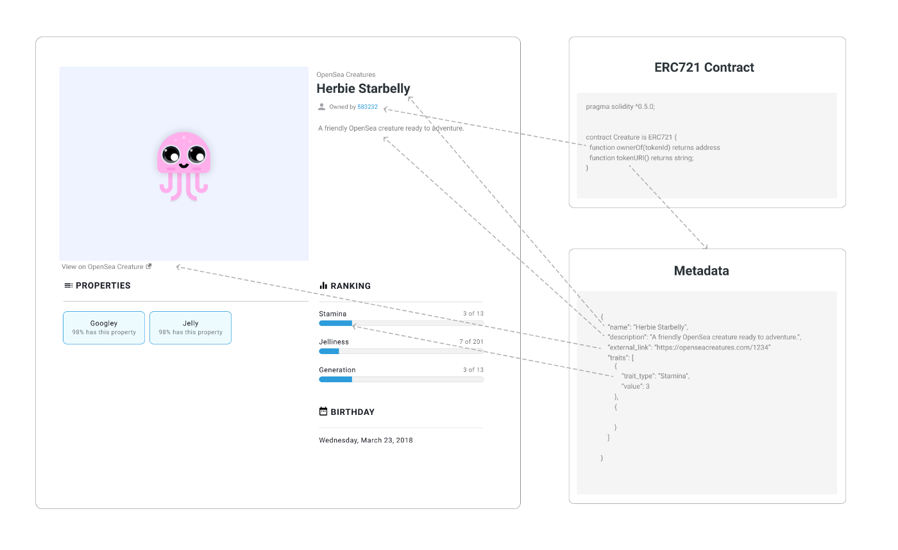

# NFT Tutorial
En este tutorial de NFT vamos a crear desde cero un smart contract en Goerli, la red testnet de ethereum y así poder generar nuestro primer NFT

## Pre-requisites
### NodeJS — https://nodejs.org/es/download/
Entorno donde trabajaremo
### VsCode - https://code.visualstudio.com/download
IDE para crear el smart contract y poder generear nuestro NFT, tiene extensiones de solidity para facilitar el desarrollo en solidity
### Truffle — https://www.trufflesuite.com/truffle
Truffle es un entorno de desarrollo, framework y pipelines de activos para Ethereum, con el objetivo de facilitar la vida como desarrollador de Ethereum.
### OpenZeppelin - https://www.openzeppelin.com/contracts
OpenZeppelin es una biblioteca de contratos inteligentes modulares, reutilizables y seguros para la red Ethereum, escrita en solidity. Permite aprovechar los contratos estándar, probados y revisados por la comunidad para sus propios fines y puede reducir significativamente el tiempo de desarrollo de las aplicaciones.Utilizaremos contratos de preajuste en OpenZepeppelin Contracts 3 para crear un ERC721 e implementarlo usando Truffle.
### Pinata account — https://www.pinata.cloud/
Pinata account proporciona acceso a nodos públicos para todas las redes de prueba y la red principal, a través de planes gratuitos y de pago.
### Metamask Chrome extension & wallet- https://metamask.io/download.html
Wallet que nos permitirá almacenar y administrar claves, transmitir transacciones, enviar y recibir criptomonedas y tokens basados en la plataforma Ethereum.
### OpenSea - https://opensea.io/
Mercado descentralizado peer-to-peer para comprar, vender e intercambiar productos digitales, desde artículos para juegos hasta coleccionables y arte, que se basan en tecnología de token no fungible (NFT) y se ejecutan en la cadena de bloques Ethereum.
### Asset
El asset que queramos convertir en NFT, en este caso una imagen, aunque podría ser un render en 3D u otro elemento gráfico representable.

* * *

## NFT Diagram flow

* * *
## Metadata

ERC-721 contiene un string metadata que es principalmente la base de los NFT.
En este tutorial realizaremos un NFT donde la metadata se  almacenará off-chain pero utilizando el protocolo y sistema de ficheros IPFS.
No entraremos en detalle en este tutorial al respecto, pero recomiendo una lectura de este articulo de OpenSea sobre metadata y descentralización https://opensea.io/blog/announcements/decentralizing-nft-metadata-on-opensea/ 

* * *
## Subiendo la metadata a Pinata
Procederemos a subir una imagen a Pinata para aprovecharnos de IPFS y utilizarla mas tarde en nuestro smart contract

En nuestro caso, hemos subido esta imagen

* * *
##  Preparando el entorno
Iniciaremos el repositorio haciendo

`mkdir my-first-nft`

Entraremos en la carpeta recien creada

`cd my-first-nft`

Iniciamos el repositorio con npm

`npm i -y`

En cuanto a las dependencias del proyecto

`yarn add @openzeppelin/contracts`

`yarn add truffle`

Inicializamos el proyecto truffle

`npx truffle init`

* * *
##  ERC721 y Extensiones
Los Smart-contracts en solidity tienen un gran parecido con las clases en el paradigma OOP(Object Oriented Programming)
Los contratos tienen datos persistentes en las variables del estado y funciones que modifican estas variables.
Si llamasemos a una funcion de otro contrato, ejecutaría una funcion en EVM(Ethereum Virtual Machine)

En este tutorial vamos a utilizar el Preset `ERC721PresetMinterPauserAutoIdwhich` lo que contendrá varios smart-contracts con diferentes funcionalidades que nos permitirán agilizar la creación de nuestro nft.

En este enlace podeis ver el código del preset https://github.com/OpenZeppelin/openzeppelin-contracts/blob/master/contracts/token/ERC721/presets/ERC721PresetMinterPauserAutoId.sol 

* * *

